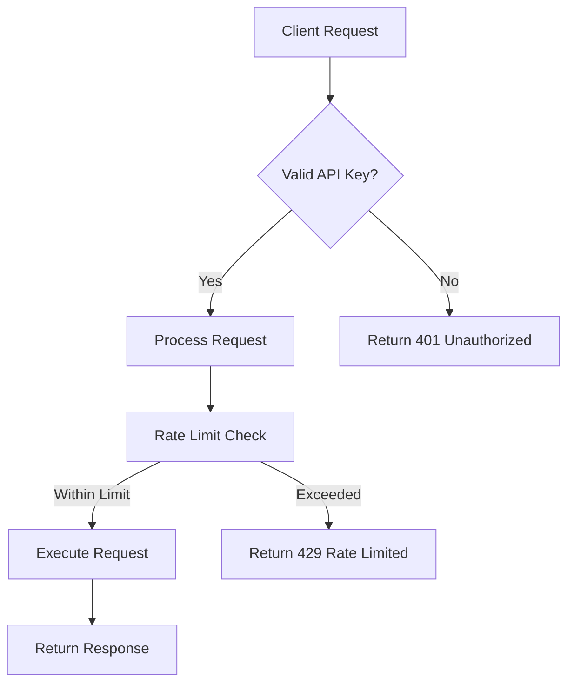
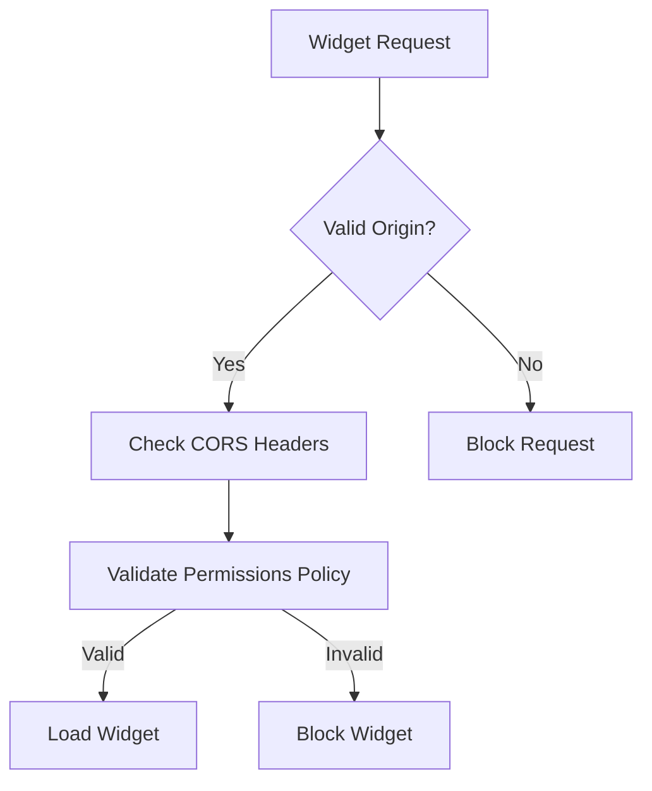

# Authentication Documentation

## Overview

Winston Chat AI implements a stateless authentication system designed for API-based access and widget embedding. The system prioritizes security while maintaining ease of integration.

## Authentication Methods

### 1. API Key Authentication

**Primary Method**: Bearer token authentication for API endpoints.

**Implementation**:
```http
Authorization: Bearer your-api-key
```

**Configuration**:
```env
API_KEY=your-secure-api-key
API_AUTH_TOKEN=your-auth-token
```

### 2. CORS-based Authentication

**Method**: Origin-based authentication for widget embedding.

**Implementation**:
- Validates request origin against allowed origins
- Configured via `ALLOWED_ORIGINS` environment variable
- Automatic validation in Next.js middleware

## Authentication Flow

### API Request Flow



### Widget Embedding Flow



## Security Implementation

### API Key Security

**Storage**:
- API keys stored in environment variables only
- Never exposed to client-side code
- Different keys for development and production

**Validation**:
```typescript
// Server-side validation
const apiKey = request.headers.get('authorization')?.replace('Bearer ', '');
if (apiKey !== process.env.API_KEY) {
  return new Response('Unauthorized', { status: 401 });
}
```

**Rotation**:
- Regular key rotation recommended
- Old keys invalidated immediately
- New keys deployed via environment variables

### CORS Security

**Configuration**:
```javascript
// next.config.js
const allowedOrigins = process.env.ALLOWED_ORIGINS?.split(',') || [];
const corsHeaders = {
  'Access-Control-Allow-Origin': origin,
  'Access-Control-Allow-Methods': 'GET, POST, OPTIONS',
  'Access-Control-Allow-Headers': 'Content-Type, Authorization'
};
```

**Validation**:
- Origin validation on every request
- Wildcard origins restricted in production
- Preflight request handling

## User Management

### Stateless Design

**No User Accounts**: Winston Chat AI operates without user accounts or persistent sessions.

**Benefits**:
- Simplified architecture
- No user data storage requirements
- Reduced security surface area
- GDPR compliance friendly

### Session Management

**Temporary Sessions**: Each chat session is temporary and stateless.

**Implementation**:
- No server-side session storage
- Client-side state management only
- Automatic cleanup on page unload

## Permission System

### API Permissions

**Read Access**:
- Health check endpoints
- Status endpoints
- Test endpoints

**Write Access**:
- Chat API (with rate limiting)
- Logging API (with validation)

### Widget Permissions

**Embedding Permissions**:
- Microphone access (via Permissions-Policy)
- Frame embedding (via CSP frame-ancestors)
- Cross-origin requests (via CORS)

**Configuration**:
```javascript
// Permissions Policy
{
  key: 'Permissions-Policy',
  value: 'microphone=(self "https://trusted-domain.com")'
}

// Content Security Policy
{
  key: 'Content-Security-Policy',
  value: 'frame-ancestors https://trusted-domain.com'
}
```

## Error Handling

### Authentication Errors

**401 Unauthorized**:
```json
{
  "error": "Invalid or missing API key",
  "code": "UNAUTHORIZED",
  "status": 401,
  "timestamp": "2024-01-15T10:30:00Z"
}
```

**403 Forbidden**:
```json
{
  "error": "Origin not allowed",
  "code": "FORBIDDEN",
  "status": 403,
  "timestamp": "2024-01-15T10:30:00Z"
}
```

### Rate Limiting Errors

**429 Too Many Requests**:
```json
{
  "error": "Rate limit exceeded",
  "code": "RATE_LIMITED",
  "status": 429,
  "retryAfter": 60,
  "timestamp": "2024-01-15T10:30:00Z"
}
```

## Security Best Practices

### API Key Management

1. **Generate Strong Keys**: Use cryptographically secure random strings
2. **Rotate Regularly**: Change keys every 90 days
3. **Monitor Usage**: Track API key usage patterns
4. **Revoke Compromised Keys**: Immediate revocation if compromised

### CORS Configuration

1. **Specific Origins**: Avoid wildcard origins in production
2. **HTTPS Only**: Require HTTPS for all origins
3. **Regular Review**: Audit allowed origins regularly
4. **Minimal Permissions**: Only grant necessary permissions

### Environment Security

1. **Secure Storage**: Use secure environment variable storage
2. **Access Control**: Limit access to production environment
3. **Audit Logs**: Monitor environment variable changes
4. **Backup Keys**: Secure backup of critical keys

## Integration Examples

### JavaScript SDK

```typescript
class WinstonChatAuth {
  private apiKey: string;
  private baseUrl: string;

  constructor(apiKey: string, baseUrl = 'https://chat.winstonai.io') {
    this.apiKey = apiKey;
    this.baseUrl = baseUrl;
  }

  private async makeRequest(endpoint: string, data?: any) {
    const response = await fetch(`${this.baseUrl}${endpoint}`, {
      method: data ? 'POST' : 'GET',
      headers: {
        'Content-Type': 'application/json',
        'Authorization': `Bearer ${this.apiKey}`
      },
      body: data ? JSON.stringify(data) : undefined
    });

    if (!response.ok) {
      throw new Error(`API request failed: ${response.status}`);
    }

    return response.json();
  }

  async sendMessage(message: string) {
    return this.makeRequest('/api/chat', {
      messages: [{ role: 'user', content: message }]
    });
  }
}
```

### Widget Integration

```html
<!-- Widget with proper authentication -->
<script>
  window.WinstonChat = {
    apiKey: 'your-api-key',
    baseUrl: 'https://chat.winstonai.io',
    onLoad: function() {
      console.log('Winston Chat loaded successfully');
    }
  };
</script>
<script src="https://chat.winstonai.io/embed.js"></script>
```

## Monitoring and Auditing

### Authentication Monitoring

**Metrics to Track**:
- Failed authentication attempts
- API key usage patterns
- CORS violation attempts
- Rate limit violations

**Alerting**:
- Unusual authentication patterns
- Multiple failed attempts from same IP
- API key usage spikes
- CORS policy violations

### Security Auditing

**Regular Audits**:
- API key rotation status
- CORS configuration review
- Environment variable security
- Access permission review

**Incident Response**:
- Immediate key revocation procedures
- CORS policy emergency updates
- Environment variable lockdown
- Access permission emergency changes

