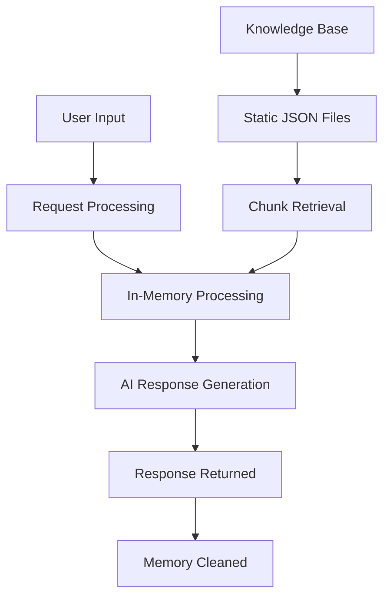

# Database Documentation

## Overview

Winston Chat AI implements a **stateless, no-database architecture** designed for maximum security, performance, and simplicity. The system processes all data in-memory during request lifecycle without persistent storage.

## Architecture Philosophy

### Stateless Design

**Core Principle**: No persistent data storage for user interactions.

**Benefits**:
- **Security**: No user data at risk of breach
- **Privacy**: GDPR compliance by design
- **Performance**: No database queries or I/O operations
- **Scalability**: Horizontal scaling without data consistency concerns
- **Simplicity**: Reduced infrastructure complexity

### Data Flow



## Data Management Patterns

### 1. Knowledge Base Storage

**Storage Method**: Static JSON files in `client-data/` directory.

**File Structure**:
```
client-data/
├── winstonchat-chunks.json    # Winston Chat AI knowledge base
├── werule-chunks.json         # WeRule platform knowledge base
├── william-chunks.json        # Portfolio knowledge base
├── werule-seo.json           # SEO metadata
└── werule.xml               # Source XML data
```

**Chunk Format**:
```json
{
  "chunks": [
    {
      "id": "chunk_001",
      "content": "Winston Chat AI is an enterprise-grade embeddable chatbot...",
      "metadata": {
        "title": "Introduction to Winston Chat AI",
        "url": "https://chat.winstonai.io",
        "type": "overview"
      },
      "embedding": [0.1, 0.2, 0.3, ...]
    }
  ]
}
```

### 2. Configuration Storage

**Storage Method**: Environment variables and TypeScript configuration files.

**Configuration Files**:
- `app/lib/siteConfig.ts` - Site mapping and configuration
- `app/lib/prompts.ts` - System prompts for different knowledge bases
- `app/lib/config.ts` - Application configuration

**Environment Variables**:
```env
OPENAI_API_KEY=sk-...
NEXT_PUBLIC_PORTFOLIO_HOST=your-domain.com
ALLOWED_ORIGINS=https://your-domain.com
RATE_LIMIT_MAX=60
```

### 3. Runtime Data Management

**In-Memory Processing**: All user data processed in memory during request lifecycle.

**Data Lifecycle**:
1. **Request Received**: User message and context loaded into memory
2. **Processing**: AI processing with knowledge base chunks
3. **Response Generated**: AI response created in memory
4. **Response Returned**: Data sent to client
5. **Memory Cleaned**: All temporary data cleared

## Knowledge Base Management

### Chunk Retrieval System

**Implementation**: Semantic search over pre-processed chunks.

**Process**:
1. **Query Processing**: User query converted to embedding
2. **Similarity Search**: Cosine similarity with stored chunks
3. **Context Assembly**: Most relevant chunks selected
4. **Context Injection**: Chunks injected into AI prompt

**Code Example**:
```typescript
// app/lib/retrieval.ts
export async function retrieveRelevantChunks(
  query: string,
  kb: string,
  maxChunks: number = 5
): Promise<Chunk[]> {
  const chunks = await loadKnowledgeBase(kb);
  const queryEmbedding = await generateEmbedding(query);
  
  const similarities = chunks.map(chunk => ({
    chunk,
    similarity: cosineSimilarity(queryEmbedding, chunk.embedding)
  }));
  
  return similarities
    .sort((a, b) => b.similarity - a.similarity)
    .slice(0, maxChunks)
    .map(item => item.chunk);
}
```

### Knowledge Base Updates

**Update Process**:
1. **Source Data**: XML or other source data updated
2. **Chunking**: Content processed into chunks with embeddings
3. **File Generation**: New JSON files generated
4. **Deployment**: Files deployed to production
5. **Cache Invalidation**: Application cache cleared

**Scripts**:
```bash
# Ingest WeRule XML data
npm run ingest:werule

# Ingest William portfolio data
npm run ingest:william
```

## Data Security

### No Persistent Storage

**User Data**: Never stored permanently.

**Benefits**:
- No data breach risk
- No GDPR compliance requirements
- No data retention policies needed
- No backup/restore procedures

### Memory Security

**Temporary Storage**: Data exists only during request processing.

**Security Measures**:
- Automatic memory cleanup
- No data persistence between requests
- Secure memory handling
- No data leakage between users

### Knowledge Base Security

**Static Files**: Knowledge base files are read-only.

**Security Measures**:
- Files served as static assets
- No dynamic content generation
- Content validation on ingestion
- Regular security audits

## Performance Considerations

### Memory Usage

**Optimization Strategies**:
- Lazy loading of knowledge base chunks
- Efficient chunk retrieval algorithms
- Memory cleanup after each request
- Minimal memory footprint

### Response Time

**Performance Factors**:
- No database queries (faster response)
- In-memory processing (low latency)
- Efficient chunk retrieval
- Optimized AI prompts

### Scalability

**Horizontal Scaling**:
- Stateless design enables easy scaling
- No database bottlenecks
- Load balancer friendly
- CDN compatible

## Data Migration and Updates

### Knowledge Base Updates

**Process**:
1. **Content Updates**: Source content updated
2. **Chunking Process**: New chunks generated
3. **File Replacement**: JSON files updated
4. **Deployment**: New files deployed
5. **Verification**: System tested with new data

### Configuration Updates

**Environment Variables**:
- Updated in deployment platform
- No database migration needed
- Immediate effect on deployment
- Rollback via environment variable change

### Version Control

**File-based Versioning**:
- Knowledge base files in version control
- Configuration files tracked
- Environment variables documented
- Change history maintained

## Monitoring and Observability

### Data Flow Monitoring

**Metrics Tracked**:
- Knowledge base load times
- Chunk retrieval performance
- Memory usage patterns
- Response generation time

### Error Handling

**Data-related Errors**:
- Knowledge base file not found
- Chunk retrieval failures
- Memory allocation errors
- Configuration validation errors

### Health Checks

**Database Health**:
- Knowledge base file accessibility
- Configuration validation
- Memory availability
- File system health

## Future Considerations

### Potential Database Integration

**If Database Needed**:
- User session storage
- Analytics and metrics
- Configuration management
- Audit logging

**Recommended Technologies**:
- **PostgreSQL**: For structured data
- **Redis**: For caching and sessions
- **MongoDB**: For document storage
- **Supabase**: For full-stack solution

### Data Architecture Evolution

**Current**: Stateless, file-based
**Future Options**:
- Hybrid approach (file + database)
- Full database migration
- Microservices architecture
- Event-driven data flow

## Best Practices

### Knowledge Base Management

1. **Regular Updates**: Keep knowledge base current
2. **Content Validation**: Validate all ingested content
3. **Version Control**: Track all changes
4. **Backup Strategy**: Backup knowledge base files

### Configuration Management

1. **Environment Separation**: Different configs for different environments
2. **Secret Management**: Secure storage of sensitive data
3. **Documentation**: Document all configuration options
4. **Validation**: Validate configuration on startup

### Performance Optimization

1. **Chunk Size**: Optimize chunk size for retrieval
2. **Caching**: Implement appropriate caching strategies
3. **Memory Management**: Monitor and optimize memory usage
4. **Response Time**: Track and optimize response times

