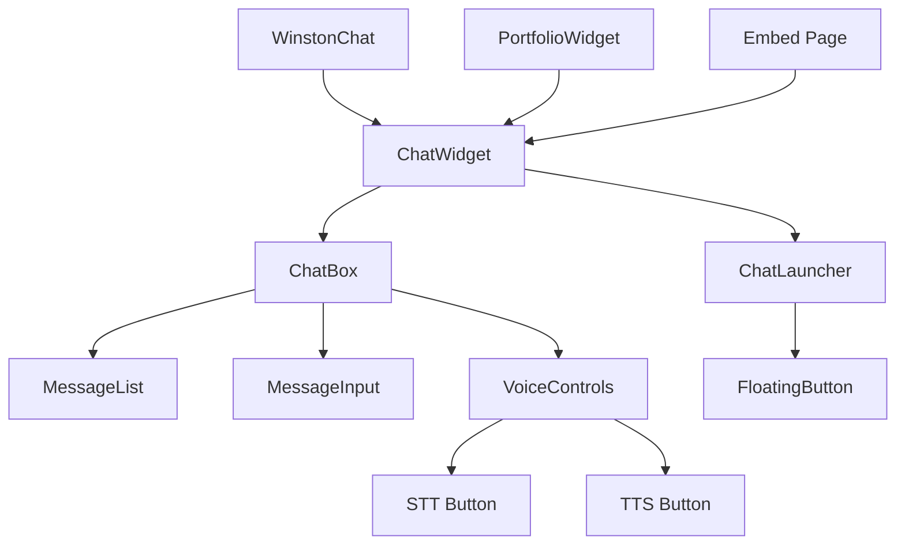

# Frontend Documentation

## Overview

Winston Chat AI's frontend is built with React, Next.js, and Tailwind CSS, following a mobile-first design approach with accessibility-first principles. The architecture emphasizes component reusability, performance, and seamless integration.

## Architecture

### Component Hierarchy



### Tech Stack

- **Framework**: Next.js 14.2.32 (App Router)
- **Language**: TypeScript
- **Styling**: Tailwind CSS + Shadcn/UI
- **State Management**: React hooks and context
- **Voice**: Web Speech API
- **Icons**: Custom SVG icons

## Core Components

### 1. WinstonChat

**File**: `app/components/WinstonChat.tsx`

**Purpose**: Main chat application component with site-specific configuration.

**Props**:
```typescript
interface WinstonChatProps {
  siteId?: string;
  mode?: 'guide' | 'assistant';
  kb?: string;
  customGreeting?: string;
}
```

**Features**:
- Site-specific configuration
- Mode switching (guide/assistant)
- Knowledge base selection
- Custom greeting support

### 2. ChatWidget

**File**: `app/components/ChatWidget.tsx`

**Purpose**: Three-pane layout container with header, messages, and composer.

**Layout Structure**:
```typescript
<div className="flex flex-col h-full">
  <header className="flex-shrink-0">
    {/* Header content */}
  </header>
  <main className="flex-1 overflow-y-auto">
    {/* Messages area */}
  </main>
  <footer className="flex-shrink-0">
    {/* Composer area */}
  </footer>
</div>
```

**Features**:
- Responsive three-pane layout
- Scrollable message area
- Fixed header and composer
- Accessibility support

### 3. ChatBox

**File**: `app/components/ChatBox.tsx`

**Purpose**: Core chat interface with message handling and voice controls.

**State Management**:
```typescript
const [messages, setMessages] = useState<Message[]>([]);
const [isLoading, setIsLoading] = useState(false);
const [mode, setMode] = useState<'guide' | 'assistant'>('guide');
const [kb, setKb] = useState<string>('winstonchat');
```

**Features**:
- Message history management
- Loading states
- Mode switching
- Voice controls integration

### 4. Voice Controls

**Files**: `app/hooks/useSTT.ts`, `app/hooks/useTTS.ts`

**Purpose**: Speech-to-text and text-to-speech functionality.

**STT Hook**:
```typescript
export const useSTT = () => {
  const [isListening, setIsListening] = useState(false);
  const [transcript, setTranscript] = useState('');
  
  const startListening = () => {
    // Speech recognition implementation
  };
  
  const stopListening = () => {
    // Stop recognition
  };
  
  return { isListening, transcript, startListening, stopListening };
};
```

**TTS Hook**:
```typescript
export const useTTS = () => {
  const [isSpeaking, setIsSpeaking] = useState(false);
  
  const speak = (text: string) => {
    // Text-to-speech implementation
  };
  
  const stopSpeaking = () => {
    // Stop speech
  };
  
  return { isSpeaking, speak, stopSpeaking };
};
```

## UI/UX Design

### Design System

**Color Palette**:
```css
:root {
  --primary: 220 14% 96%;        /* Light gray */
  --secondary: 220 14% 9%;        /* Dark gray */
  --accent: 220 14% 96%;          /* Light accent */
  --muted: 220 14% 96%;           /* Muted text */
  --border: 220 14% 90%;          /* Border color */
  --input: 220 14% 96%;           /* Input background */
  --ring: 220 14% 9%;             /* Focus ring */
}
```

**Typography**:
- **Font Family**: Geist (system font stack)
- **Headings**: Font weight 600, responsive sizing
- **Body Text**: Font weight 400, 16px base
- **Code**: Monospace font for technical content

**Spacing**:
- **Padding**: 16px, 24px, 32px scale
- **Margins**: 8px, 16px, 24px scale
- **Gaps**: 8px, 16px, 24px scale

### Responsive Design

**Breakpoints**:
```css
/* Mobile First */
@media (min-width: 640px) { /* sm */ }
@media (min-width: 768px) { /* md */ }
@media (min-width: 1024px) { /* lg */ }
@media (min-width: 1280px) { /* xl */ }
```

**Mobile Optimizations**:
- Touch-friendly button sizes (44px minimum)
- Optimized keyboard navigation
- Swipe gestures for message interaction
- Responsive text sizing

### Accessibility

**ARIA Implementation**:
```typescript
<div
  role="log"
  aria-live="polite"
  aria-label="Chat messages"
  className="message-container"
>
  {/* Messages */}
</div>
```

**Keyboard Navigation**:
- Tab order optimization
- Focus management
- Keyboard shortcuts
- Screen reader support

**WCAG 2.1 Compliance**:
- Color contrast ratios
- Focus indicators
- Alternative text
- Semantic HTML

## State Management

### React Hooks

**useState for Local State**:
```typescript
const [messages, setMessages] = useState<Message[]>([]);
const [isLoading, setIsLoading] = useState(false);
const [error, setError] = useState<string | null>(null);
```

**useEffect for Side Effects**:
```typescript
useEffect(() => {
  // Initialize chat
  initializeChat();
}, []);

useEffect(() => {
  // Handle mode changes
  handleModeChange(mode);
}, [mode]);
```

**Custom Hooks for Reusable Logic**:
```typescript
// Voice functionality
const { isListening, startListening, stopListening } = useSTT();
const { isSpeaking, speak, stopSpeaking } = useTTS();

// API calls
const { sendMessage, isLoading, error } = useChatAPI();
```

### Context for Global State

**Chat Context**:
```typescript
const ChatContext = createContext<{
  messages: Message[];
  addMessage: (message: Message) => void;
  clearMessages: () => void;
  mode: 'guide' | 'assistant';
  setMode: (mode: 'guide' | 'assistant') => void;
}>({});
```

## Performance Optimization

### Code Splitting

**Dynamic Imports**:
```typescript
const VoiceControls = dynamic(() => import('./VoiceControls'), {
  loading: () => <div>Loading voice controls...</div>
});
```

**Lazy Loading**:
```typescript
const ChatWidget = lazy(() => import('./ChatWidget'));
```

### Memoization

**React.memo for Components**:
```typescript
const MessageItem = React.memo(({ message }: { message: Message }) => {
  return <div>{message.content}</div>;
});
```

**useMemo for Expensive Calculations**:
```typescript
const processedMessages = useMemo(() => {
  return messages.map(processMessage);
}, [messages]);
```

**useCallback for Event Handlers**:
```typescript
const handleSendMessage = useCallback((content: string) => {
  sendMessage(content);
}, [sendMessage]);
```

### Bundle Optimization

**Tree Shaking**: Unused code eliminated
**Minification**: Production builds minified
**Compression**: Gzip compression enabled
**CDN**: Static assets served from CDN

## Integration Patterns

### Widget Embedding

**Script Tag Integration**:
```html
<script>
  window.WinstonChat = {
    apiKey: 'your-api-key',
    siteId: 'portfolio',
    mode: 'guide'
  };
</script>
<script src="https://chat.winstonai.io/embed.js"></script>
```

**Iframe Integration**:
```html
<iframe
  src="https://chat.winstonai.io/winston-widget"
  width="400"
  height="600"
  frameborder="0"
  allow="microphone"
></iframe>
```

### API Integration

**Fetch API Usage**:
```typescript
const sendMessage = async (content: string) => {
  const response = await fetch('/api/chat', {
    method: 'POST',
    headers: {
      'Content-Type': 'application/json',
      'Authorization': `Bearer ${apiKey}`
    },
    body: JSON.stringify({
      messages: [{ role: 'user', content }],
      mode,
      kb
    })
  });
  
  return response.json();
};
```

## Error Handling

### Error Boundaries

**Component Error Boundary**:
```typescript
class ErrorBoundary extends React.Component {
  constructor(props) {
    super(props);
    this.state = { hasError: false };
  }
  
  static getDerivedStateFromError(error) {
    return { hasError: true };
  }
  
  render() {
    if (this.state.hasError) {
      return <div>Something went wrong.</div>;
    }
    
    return this.props.children;
  }
}
```

### Error States

**Loading States**:
```typescript
{isLoading && (
  <div className="loading-indicator">
    <div className="spinner" />
    <span>Thinking...</span>
  </div>
)}
```

**Error Messages**:
```typescript
{error && (
  <div className="error-message" role="alert">
    <span>Error: {error}</span>
    <button onClick={retry}>Retry</button>
  </div>
)}
```

## Testing

### Component Testing

**Test Setup**:
```typescript
import { render, screen, fireEvent } from '@testing-library/react';
import ChatBox from './ChatBox';

test('renders chat interface', () => {
  render(<ChatBox />);
  expect(screen.getByRole('textbox')).toBeInTheDocument();
});
```

**User Interaction Testing**:
```typescript
test('sends message on submit', () => {
  const mockSendMessage = jest.fn();
  render(<ChatBox onSendMessage={mockSendMessage} />);
  
  const input = screen.getByRole('textbox');
  const button = screen.getByRole('button');
  
  fireEvent.change(input, { target: { value: 'Hello' } });
  fireEvent.click(button);
  
  expect(mockSendMessage).toHaveBeenCalledWith('Hello');
});
```

### Accessibility Testing

**Screen Reader Testing**:
- VoiceOver (macOS)
- NVDA (Windows)
- JAWS (Windows)

**Keyboard Navigation Testing**:
- Tab order verification
- Focus management
- Keyboard shortcuts

## Deployment

### Build Process

**Production Build**:
```bash
npm run build
```

**Build Output**:
- Static HTML files
- Optimized JavaScript bundles
- CSS files
- Static assets

### Environment Configuration

**Environment Variables**:
```env
NEXT_PUBLIC_API_URL=https://chat.winstonai.io
NEXT_PUBLIC_SITE_ID=portfolio
NEXT_PUBLIC_MODE=guide
```

**Runtime Configuration**:
```typescript
const config = {
  apiUrl: process.env.NEXT_PUBLIC_API_URL,
  siteId: process.env.NEXT_PUBLIC_SITE_ID,
  mode: process.env.NEXT_PUBLIC_MODE
};
```

## Maintenance

### Code Organization

**File Structure**:
```
app/
├── components/          # Reusable components
├── hooks/              # Custom hooks
├── lib/                # Utility functions
├── styles/             # Global styles
└── types/              # TypeScript types
```

**Naming Conventions**:
- Components: PascalCase (e.g., `ChatBox.tsx`)
- Hooks: camelCase starting with 'use' (e.g., `useSTT.ts`)
- Utilities: camelCase (e.g., `formatMessage.ts`)
- Types: PascalCase (e.g., `Message.ts`)

### Performance Monitoring

**Metrics to Track**:
- First Contentful Paint (FCP)
- Largest Contentful Paint (LCP)
- Cumulative Layout Shift (CLS)
- First Input Delay (FID)

**Tools**:
- Vercel Analytics
- Google PageSpeed Insights
- Lighthouse CI
- Web Vitals

