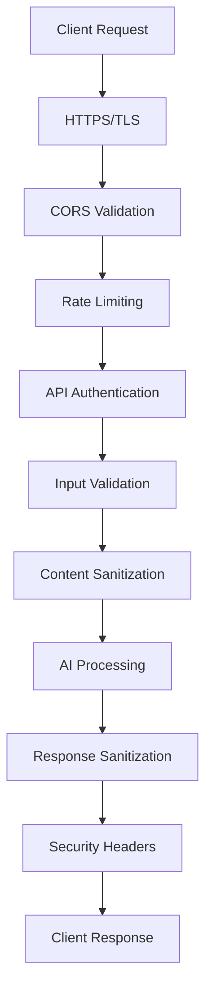

# Security Documentation

## Overview

Winston Chat AI implements comprehensive security measures to protect user data, prevent unauthorized access, and ensure safe operation across all environments. The security architecture is designed around the principle of "security by design" with multiple layers of protection.

## Security Architecture

### Defense in Depth



### Security Layers

1. **Transport Security**: HTTPS/TLS encryption
2. **Network Security**: CORS and CSP policies
3. **Authentication**: API key validation
4. **Authorization**: Origin-based access control
5. **Input Validation**: Request sanitization
6. **Processing Security**: Safe AI processing
7. **Output Security**: Response sanitization
8. **Infrastructure Security**: Secure hosting

## Data Protection

### Privacy by Design

**No Data Persistence**: 
- Chat messages are never stored permanently
- No user data in databases or logs
- Memory cleared after each request
- GDPR compliance by design

**Data Minimization**:
- Only necessary data collected
- No personal information required
- Temporary processing only
- Automatic data cleanup

### Data Flow Security

**Request Processing**:
1. User input received
2. Input validated and sanitized
3. Processed in memory only
4. AI response generated
5. Response sanitized
6. Memory cleared
7. Response returned

**No Data Leakage**:
- No cross-user data access
- No data persistence between requests
- No data logging or storage
- No data transmission to third parties

## Authentication & Authorization

### API Key Security

**Key Management**:
```typescript
// Server-side validation only
const apiKey = request.headers.get('authorization')?.replace('Bearer ', '');
if (apiKey !== process.env.API_KEY) {
  return new Response('Unauthorized', { status: 401 });
}
```

**Security Measures**:
- Keys stored in environment variables
- Never exposed to client-side code
- Different keys for different environments
- Regular key rotation recommended

### CORS Security

**Origin Validation**:
```javascript
// next.config.js
const allowedOrigins = process.env.ALLOWED_ORIGINS?.split(',') || [];
const corsHeaders = {
  'Access-Control-Allow-Origin': origin,
  'Access-Control-Allow-Methods': 'GET, POST, OPTIONS',
  'Access-Control-Allow-Headers': 'Content-Type, Authorization'
};
```

**Security Policies**:
- Specific origins only (no wildcards in production)
- HTTPS required for all origins
- Preflight request validation
- Credential handling restrictions

## Input Validation & Sanitization

### Request Validation

**Input Sanitization**:
```typescript
function sanitizeInput(input: string): string {
  return input
    .trim()
    .replace(/[<>]/g, '') // Remove potential HTML tags
    .substring(0, 1000); // Limit length
}
```

**Validation Rules**:
- Maximum message length: 1000 characters
- HTML tags stripped
- Special characters escaped
- SQL injection prevention
- XSS attack prevention

### Content Security

**Response Sanitization**:
```typescript
function sanitizeResponse(response: string): string {
  return response
    .replace(/<script\b[^<]*(?:(?!<\/script>)<[^<]*)*<\/script>/gi, '')
    .replace(/javascript:/gi, '')
    .replace(/on\w+\s*=/gi, '');
}
```

**Security Measures**:
- Script tags removed
- JavaScript URLs blocked
- Event handlers stripped
- HTML entities encoded

## Network Security

### HTTPS Enforcement

**TLS Configuration**:
- TLS 1.2+ required
- Strong cipher suites only
- HSTS headers enabled
- Certificate validation

**Redirect Configuration**:
```javascript
// Automatic HTTPS redirect
if (process.env.NODE_ENV === 'production' && !request.url.startsWith('https://')) {
  return Response.redirect(`https://${request.headers.get('host')}${request.url}`, 301);
}
```

### Security Headers

**Content Security Policy**:
```javascript
const cspHeaders = {
  'Content-Security-Policy': [
    "default-src 'self'",
    "script-src 'self' 'unsafe-inline'",
    "style-src 'self' 'unsafe-inline'",
    "img-src 'self' data: https:",
    "font-src 'self'",
    "connect-src 'self' https://api.openai.com",
    "frame-ancestors 'self' https://trusted-domain.com"
  ].join('; ')
};
```

**Additional Headers**:
```javascript
const securityHeaders = {
  'X-Frame-Options': 'DENY',
  'X-Content-Type-Options': 'nosniff',
  'X-XSS-Protection': '1; mode=block',
  'Referrer-Policy': 'strict-origin-when-cross-origin',
  'Permissions-Policy': 'microphone=(self "https://trusted-domain.com")'
};
```

## AI Security

### OpenAI Integration Security

**API Key Protection**:
- Keys stored server-side only
- Never transmitted to client
- Different keys per environment
- Regular rotation schedule

**Request Security**:
```typescript
const openaiRequest = {
  model: 'gpt-3.5-turbo',
  messages: sanitizedMessages,
  max_tokens: 500,
  temperature: 0.7,
  // No user data in prompts
};
```

**Response Validation**:
- AI responses validated before sending
- Content filtering applied
- Inappropriate content blocked
- Error handling for API failures

### Prompt Security

**System Prompt Design**:
- Professional tone only
- No harmful content generation
- Appropriate use case focus
- Error handling instructions

**User Input Handling**:
- Input sanitization before AI processing
- Context injection security
- No prompt injection vulnerabilities
- Safe response generation

## Rate Limiting & DDoS Protection

### Rate Limiting Implementation

**Request Limiting**:
```typescript
const rateLimit = new Map();

function checkRateLimit(ip: string): boolean {
  const now = Date.now();
  const windowMs = 60 * 1000; // 1 minute
  const maxRequests = 60;
  
  if (!rateLimit.has(ip)) {
    rateLimit.set(ip, { count: 1, resetTime: now + windowMs });
    return true;
  }
  
  const userLimit = rateLimit.get(ip);
  if (now > userLimit.resetTime) {
    rateLimit.set(ip, { count: 1, resetTime: now + windowMs });
    return true;
  }
  
  if (userLimit.count >= maxRequests) {
    return false;
  }
  
  userLimit.count++;
  return true;
}
```

**Protection Measures**:
- 60 requests per minute per IP
- Configurable limits
- Automatic reset windows
- Blocked IP logging

### DDoS Mitigation

**Infrastructure Protection**:
- Vercel's built-in DDoS protection
- CDN-based traffic filtering
- Geographic distribution
- Automatic scaling

**Application-Level Protection**:
- Rate limiting per IP
- Request size limits
- Connection timeouts
- Resource usage monitoring

## Vulnerability Management

### Security Scanning

**Dependency Scanning**:
```bash
# Regular security audits
npm audit
npm audit fix

# Dependency updates
npm update
npm outdated
```

**Code Analysis**:
- ESLint security rules
- TypeScript strict mode
- Static code analysis
- Manual code reviews

### Vulnerability Response

**Incident Response Plan**:
1. **Detection**: Monitor for security issues
2. **Assessment**: Evaluate threat level
3. **Containment**: Isolate affected systems
4. **Eradication**: Remove threat
5. **Recovery**: Restore normal operations
6. **Lessons Learned**: Update security measures

**Patch Management**:
- Regular dependency updates
- Security patch prioritization
- Testing before deployment
- Rollback procedures

## Compliance & Standards

### GDPR Compliance

**Data Protection Measures**:
- No personal data collection
- No data storage
- No data processing beyond request lifecycle
- No data sharing with third parties

**User Rights**:
- Right to be forgotten (automatic)
- Right to data portability (not applicable)
- Right to rectification (not applicable)
- Right to access (not applicable)

### Security Standards

**OWASP Top 10 Compliance**:
- A01: Broken Access Control ✅
- A02: Cryptographic Failures ✅
- A03: Injection ✅
- A04: Insecure Design ✅
- A05: Security Misconfiguration ✅
- A06: Vulnerable Components ✅
- A07: Authentication Failures ✅
- A08: Software Integrity Failures ✅
- A09: Logging Failures ✅
- A10: Server-Side Request Forgery ✅

## Monitoring & Auditing

### Security Monitoring

**Metrics Tracked**:
- Failed authentication attempts
- Rate limit violations
- CORS policy violations
- API error rates
- Response times

**Alerting**:
- Unusual traffic patterns
- Multiple failed attempts
- API key usage spikes
- Error rate increases

### Security Auditing

**Regular Audits**:
- Monthly security reviews
- Quarterly penetration testing
- Annual security assessments
- Continuous monitoring

**Audit Trail**:
- API access logs
- Error logs
- Security event logs
- Configuration changes

## Best Practices

### Development Security

1. **Secure Coding**:
   - Input validation
   - Output encoding
   - Error handling
   - Secure defaults

2. **Code Review**:
   - Security-focused reviews
   - Vulnerability scanning
   - Best practice enforcement
   - Documentation updates

3. **Testing**:
   - Security testing
   - Penetration testing
   - Vulnerability scanning
   - Compliance testing

### Operational Security

1. **Environment Security**:
   - Secure configuration
   - Access controls
   - Monitoring
   - Incident response

2. **Deployment Security**:
   - Secure deployment
   - Configuration validation
   - Security testing
   - Rollback procedures

3. **Maintenance Security**:
   - Regular updates
   - Security patches
   - Monitoring
   - Documentation

## Incident Response

### Security Incident Types

1. **Data Breach**: Unauthorized data access
2. **DDoS Attack**: Service disruption
3. **API Abuse**: Unauthorized API usage
4. **Configuration Error**: Security misconfiguration

### Response Procedures

1. **Immediate Response**:
   - Assess threat level
   - Isolate affected systems
   - Notify stakeholders
   - Document incident

2. **Investigation**:
   - Root cause analysis
   - Impact assessment
   - Evidence collection
   - Timeline reconstruction

3. **Recovery**:
   - System restoration
   - Security improvements
   - Monitoring enhancement
   - Documentation updates

4. **Post-Incident**:
   - Lessons learned
   - Process improvements
   - Training updates
   - Communication

